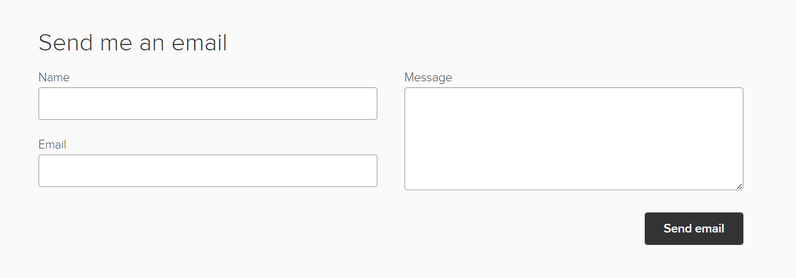

# Portfolio

## Content

- Home: (Single page)
  - Introduction with centered text
    ```
    Hey, I'm Sai
        Experienced web developer who enjoys building fast and accessible digital products.
    ```
- About: (Single page)

  - Short description

    ```
    Get to know me!
    Since 2016, I've enjoyed turning complex problems into simple and intuitive with web development. I'm proficient in Full stack web development and passionate about web performance, accessibility, user & developer experience.

    In my free time, I build side projects and like exploring new technologies. You can see some of my work in the projects section below.

    I'm open to collaboration opportunities where I can contribute, learn and grow. Don't hesitate to reach out if you think my skills and experience are a good fit for your next project.
    ```

  - Skill sets (Use Icons like a sphere, `size === experience`)
    

- Portfolio
  - Play the game
  - Explore the projects
- Contact
  - Send email
    - LinkedIn, GitHub
    - Name, Email, Message
      
- Footer
  

## Enhancements

## References

https://websitedemos.net/personal-portfolio-02/?customize=template
https://www.adhamdannaway.com/
